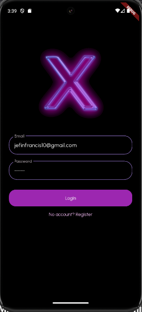
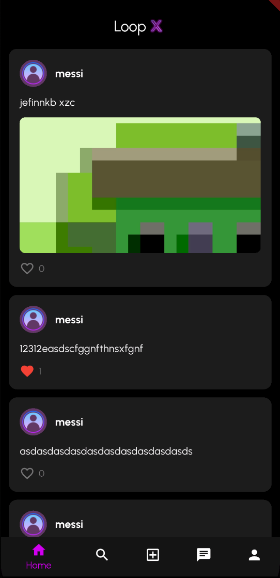
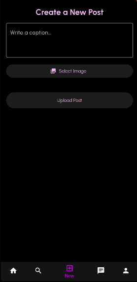
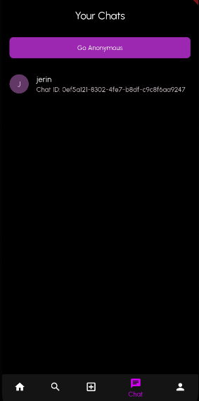
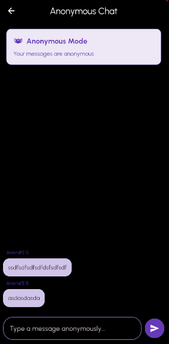
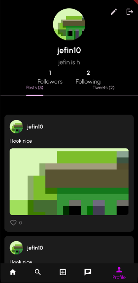

# 📱 LoopX — Flutter + Supabase Social App

LoopX is a modern mobile app inspired by Threads + Instagram, built using **Flutter**, **Supabase**, and soon **Riverpod**. It features real-time 1-on-1 messaging, profile systems, post sharing, search, and anonymous chat.

---

## 🚀 Features

- ✅ **User Authentication** via Supabase
- 📝 **Post Creation** with media support
- ❤️ **Like System** for posts
- 👤 **User Profiles** with post history
- 🔍 **Search Users & Posts**
- 💬 **Real-time 1-on-1 Chat** (Supabase Realtime + Channels)
- 🕵️ **Anonymous Chat Mode** for spontaneous conversations

---

## 🧱 Tech Stack

| Layer | Stack |
|-------|-------|
| UI    | Flutter (Material 3), go_router |
| State Mgmt | Coming soon: Riverpod |
| Backend | Supabase (Auth, Realtime DB, Storage) |
| DB     | PostgreSQL (via Supabase) |
| Future | Hive for offline caching, Clean Architecture, Edge Functions, AI add-ons |

---

## 📸 Screenshots

| Login/Register | Home Feed | Create Post |
|----------------|-----------|-------------|
|  |  |  |

| Chat Screen | Anonymous Chat | Profile |
|-------------|----------------|---------|
|  |  |  |

> Upload screenshots in the `screenshots/` folder and update the image links above.

---

## 🧭 Project Structure (Clean Architecture Inspired)

